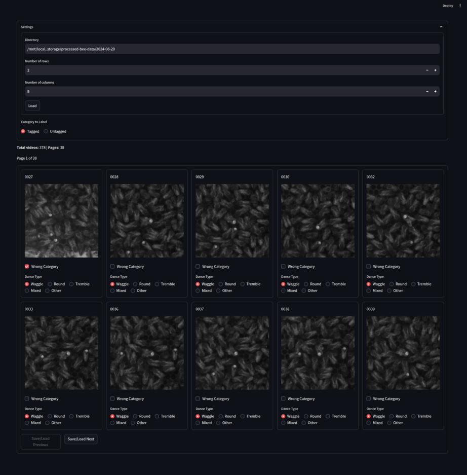

# **bb_wdd_label_gui**

A browser-based interface for labeling WDD video snippets with tag status and dance type.



## Installation

```bash
conda activate beesbook
pip install git+https://github.com/BioroboticsLab/bb_wdd_label_gui.git
```

## Usage
### Option 1: Data already classified
If your WDD output data has already been processed (e.g., via a tag status classifier such as https://github.com/BioroboticsLab/bb_wdd_tag_classifier), you can launch the interface directly to view and correct labels:

```bash
streamlit run main.py
```

## Option 2: Raw WDD output without tag status classification
If you're starting with raw WDD output data and have not yet classified tag status, you can preprocess the data using the included script:

```bash
python3 processing.py <input_dir> <output_dir>
```

Replace `<input_dir>` with the path to your WDD output directory and `<output_dir>` with your desired output location.

The script will:
* Create the required directory structure inside `output_dir`
* Encode the video snippets into MP4 format (since Streamlit cannot play APNG files as videos)
* Move the MP4 snippets into the structure, treating them as untagged.

Then, launch the interface:

```bash
streamlit run main.py
```
